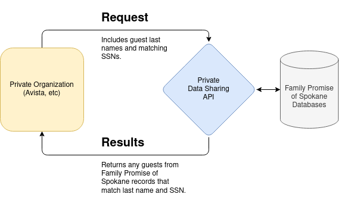
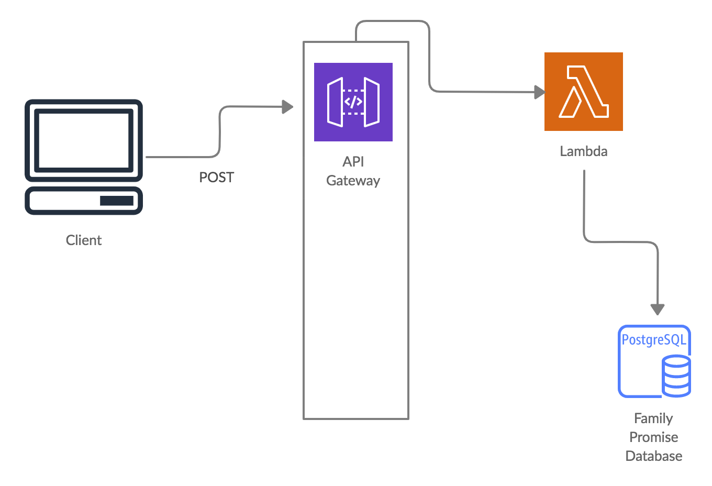

# Family Promise of Spokane Data Sharing
## Project Overview
Avista Utilities wants to know if customers that have fallen behind on payments prior to ceasing to be customers have ended up at a homeless shelter. With this information they are building a model that is able to predict when current customers become at risk of homelessness in order to provide them with the resources needed to prevent it.

**Solution**: We designed an API that uses unique identifiers to determine if a previous customer began receiving services from organizations assisting people experiencing homelessness. At the moment, the API only queries from the Family Promise of Spokane database. We are looking to expand to this service to other shelters and service providers.

## Tech Stack
**Languages**: Python, SQL  
**Dependencies**: Pandas, cryptography, psycopg2  
**AWS**: Chalice, Lambda, API Gateway  
**Services**: ElephantSQL  

## Architecture


**Note**: The results from the API response also includes individuals with matching last names (ie. other family members) and those last names that were not found in our databases.



## Development
#### Clone repository and initialize a virtual environment
`pipenv shell`

#### Install dependencies
`pipenv install`

#### Configure environment variables in `~/.chalice/config.json`
Request environment variables from your Family Promise IT/Data Systems Manager.
```
{
    "version": "2.0",
    "app_name": "data-sharing-api",
    "stages": {
        "dev": {
            "api_gateway_stage": "api",
            "environment_variables": {
                "DB_HOST": "sample_host",
                "DB_USER": "sample_user",
                "DB_PWD": "sample_pwd",
                "WEB_PWD": "sample_pwd",
                "ENCRYPTION_KEY": "sample_key
            }
        }
    }
}
```

#### Begin local development
`cd fernet-api`  
`chalice local`

#### Before deployment, AWS credentials must be configured
   - If AWS CLI has already been configured you can skip this step
   - Else credentials can be usually configured at `~/.aws/config` with this content:
      ```
      [default]
      aws_access_key_id=<your-access-key-id>
      aws_secret_access_key=<your-secret-access-key>
      region=<your-region>
      ```
   - More details here: [AWS Command Line Interface](https://docs.aws.amazon.com/cli/latest/userguide/cli-chap-welcome.html)

#### With AWS credentials in place, begin deployment process
`chalice deploy`

## Route Overview

**API URL**:
`https://z0arg6enmk.execute-api.us-east-1.amazonaws.com/api/`

### Return guest information

Returns limited information about guests that are found in our databases. Response return both full matches (last name and ssn match) and partial matches (last name matches only) as well as last names from the request that were not found in our databases.

#### Request
`POST /guests`
```
{
    "last_name": [
        "smith", 
        "brown",
        "wilson",
    ],
    "ssn": [
        1234, 
        1234,
        1234
    ],
    "pwd": "sample_password"
}
```

#### Response
```
Status: 200 OK
Content-Type: application/json

{
    "full_matches": [
        {
            "first_name": "john",
            "last_name": "brown"
            "enroll_date": "10-22-2018",
            "exit_date": "10-25-2018",
            "exit_destination": "Rental by client, other ongoing housing subsidy",
            "income_at_entry": 1234.0,
            "income_at_exit": 2234.0,
        }
    ],
   "partial_matches": [
       {
           "first_name": "james",
           "last_name": "smith"
           "enroll_date": "10-22-2018",
           "exit_date": "10-25-2018",
           "exit_destination": "Rental by client, no ongoing housing subsidy",
           "income_at_entry": 1234.0,
           "income_at_exit": 2234.0,
        }
    ],
    "no_match_found": [
        "wilson"
    ]
}
```

## License
MIT
